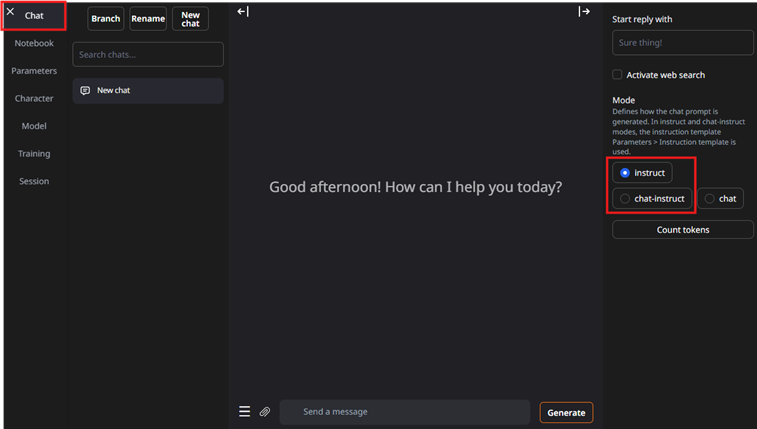

# RunpodTextGenWebUI

Source code for the RunPod template: [text-generation-webui-aio](https://console.runpod.io/deploy?template=y11d9xokre&ref=7mxtxxqo)

This template runs [text-generation-webui](https://github.com/oobabooga/text-generation-webui) on RunPod.

It was inspired by [TheBloke's deprecated DockerLLM project](https://github.com/TheBlokeAI/dockerLLM).

You can use this template to experiment with nearly any LLM hosted on Hugging Face.

> ⚠️ **Disclaimer**: This Dockerfile is intended for experimental use only and is not suitable for production workloads. I take no responsibility for any data loss or security issues. Review the code and proceed at your own risk.

Building the Dockerfile:
```
cd text-generation-webui-docker/
docker build -t text-generation-webui-aio .
```

---

## Table of Contents

- [Instructions](#instructions)
  - [Set Up a RunPod Account](#set-up-a-runpod-account)
  - [Setting Up SSH Key (Optional)](#setting-up-ssh-key-optional)
  - [Create Network Volume (Optional)](#create-network-volume-optional)
  - [Create RunPod Secrets](#create-runpod-secrets)
  - [Creating Your Pod](#creating-your-pod)
  - [Accessing text-generation-webui](#accessing-text-generation-webui)
  - [Downloading and Loading a Model](#downloading-and-loading-a-model)
  - [Calling the API](#calling-text-generation-webui-api)
  - [Loading a EXL2 model on multiple GPU's](#loading-a-exl2-model-on-multiple-gpus)
  - [Loading a GGUF model on multiple GPU's](#loading-a-gguf-model-on-multiple-gpus)
  - [Connecting to Open WebUI](#connecting-to-open-webui)
  - [Connecting to SillyTavern](#connecting-text-generation-webui-to-sillytavern)

---

## Instructions

### Set Up a RunPod Account

RunPod is a paid cloud GPU provider. Go to [https://www.runpod.io/](https://www.runpod.io/), create an account, and add funds.

For this example, we’ll use an RTX A5000, which costs around $0.21/hour + storage.

### Setting Up SSH Key (Optional)

If you want SSH access to your pod, add your SSH public key in your RunPod account settings.


### Create Network Volume (Optional)

To avoid re-downloading models every time, you can create a persistent network volume. Make sure the volume is in the **same region** as your pod.

Note: Storage isn't free — 200 GB costs about $15/month.


### Create RunPod Secrets

Create these secrets in RunPod for authentication:

- `GRADIO_USERNAME` and `GRADIO_PASSWORD`: Used to log into the web UI.
- `MY_OPENAI_KEY`: Used for calling the OpenAI-compatible API.


### Creating Your Pod

Your pod is the GPU-powered container that runs this template.

1. Go to `Pods` and select a GPU like `RTX A5000`. Make sure “Secure Cloud” is selected.


2. Click `Change Template`, search for `text-generation-webui-aio`, and select the one from `mattipaivike321/runpod-text-generation-webui`.

  


The correct template:


3. Click `Edit Template`.


- If you don’t need SSH, remove port 22 from **Expose TCP Ports**.


- You can also adjust the “Volume Disk” size. This is local storage for downloading models. For this guide, use **at least 50 GB**. Keep in mind that storage also incurs costs (~$0.10/GB/month).

More info: https://docs.runpod.io/pods/storage/types

4. Click `Set Overrides` and then `Deploy On-Demand`.


Deployment may take several minutes depending on your region.


### Accessing text-generation-webui

Once the pod is ready:

1. Click `Connect`, then choose `HTTP Service 7860`.  
   *(Port 5000 is reserved for API access.)*

  


2. Log in using your `GRADIO_USERNAME` and `GRADIO_PASSWORD`.


### Downloading and Loading a Model

You can run any model that fits into your GPU’s VRAM.

For this guide, we’ll use an EXL2 model:  
[MikeRoz/mistralai_Mistral-Small-24B-Instruct-2501-6.0bpw-h6-exl2](https://huggingface.co/MikeRoz/mistralai_Mistral-Small-24B-Instruct-2501-6.0bpw-h6-exl2)

Make sure the total size of the `.safetensors` files is within your GPU’s capacity (RTX A5000 has 24 GB VRAM). Also some left over vram is needed for the context.


The same applies to GGUF models. Use this tool to check required VRAM for your model and context window:  
[LLM VRAM Calculator](https://huggingface.co/spaces/NyxKrage/LLM-Model-VRAM-Calculator)

#### Download the model:

1. Copy the model path from Hugging Face:


2. Go to the `Model` tab, paste the path, and click `Download`.  For GGUF models, you must also enter the exact `.gguf` filename since most repos contain multiple quant versions


#### Load the model:

1. Refresh the model list and select your model from the dropdown.


2. Wait a few seconds — the loader will be auto-selected (e.g., `ExLlamav2_HF` for EXL2 models, different one for GGUF).

3. Increase context size (e.g., `32768`) if desired, then click `Load`. Note that the context also eats away at the vram, so there is a limit!


Loading may take a while depending on model size.


Once loaded:


Go to the `Chat` tab and try it out:



Use `chat-instruct` or `instruct` modes — they provide the correct prompt format. Avoid `chat` mode due to bugs. For more info, see the official documentation.

Working example:


> ✅ Don’t forget to **terminate your pod** when you're done to avoid extra charges!

### Calling text-generation-webui API:

There is a separate example Python script and `README.md` file in the `api-call-example/` folder of this repository. It explains how to call the text-generation-webui API programmatically.

### Loading a EXL2 model on multiple GPU's

See [this](exl2_multi_gpu_example.md) instruction on how to load a large +70GB EXL2 model on multiple GPU's.

### Loading a GGUF model on multiple GPU's

See [this](gguf_multi_gpu_example.md) instruction on how to load a large +70GB GGUF model on multiple GPU's.

### Connecting to Open WebUI:

See [openwebui_example.md](openwebui_example.md) for instructions on how to connect text-generation-webui backend to Open WebUI.

### Connecting text-generation-webui to SillyTavern:

See [sillytavern_example.md](sillytavern_example.md) for instructions on how to connect text-generation-webui backend to SillyTavern.

