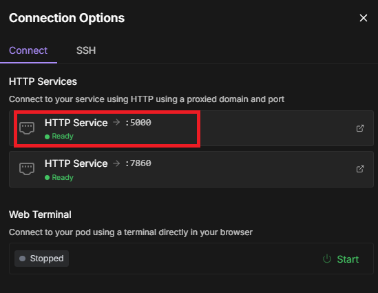

# text-generation-webui API Example

This folder contains a simple example of how to call the `text-generation-webui` API using Python.

## Prerequisites

First, set up your pod as described in the root [`README.md`](../README.md).

Then install the required Python packages:

```
pip install sseclient-py requests
```

## Get Your API URL

In the RunPod interface, fetch the **API endpoint** by clicking `Connect` and selecting **HTTP Service 5000**:



## Configure Your API Key

When setting up your pod, you created the `MY_OPENAI_KEY` secret. Copy its value and use it in the `call_api.py` script.

Make sure both the API URL and API key are correctly set in the script.

## Run the Script

To make the request:

```
python call_api.py
```

This script uses asynchronous streaming to fetch responses. This is necessary because RunPod proxies traffic through Cloudflare, which can interfere with long-running synchronous HTTP requests.

## More Info

For more detailed documentation on the OpenAI-compatible API, see the official text-generation-webui docs:  
https://github.com/oobabooga/text-generation-webui/blob/main/docs/12%20-%20OpenAI%20API.md
