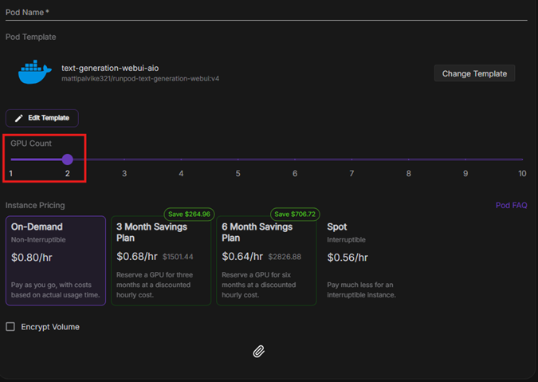
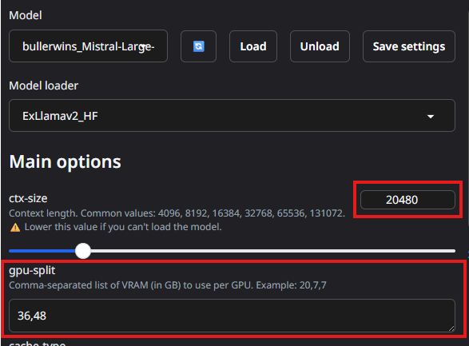

### Loading a EXL2 model on multiple GPU's

Now we get to the interesting part. Text-generation-webui supports multiple GPUs, allowing you to split a model across several cards. This enables running larger LLMs relatively cheaply.

Let’s try running **Mistral Large** on a pair of 48 GB GPUs.

Create a new pod, but this time select the `A40` GPU and set the GPU count to `2`:

Deploy the pod as usual, but now we’ll download a bigger model. Here’s a 5.0bpw EXL2 quant of Mistral Large:  
https://huggingface.co/bullerwins/Mistral-Large-Instruct-2407-exl2_5.0bpw/tree/main

With 2 × 48 GB GPUs (96 GB total), we have enough VRAM to fit both the model and a large context window.

Copy the model path from Hugging Face and download it as before.

Before loading the model, we need to adjust the loader settings manually:

- Set **GPU split** to `36,48`. This means 36 GB of VRAM will be used on the first GPU and 48 GB on the second.
- The remaining 12 GB on the first GPU is reserved for the context window.
- Set **ctx-size** (context window) to `20480`.

Click Load. It may take a while, but once complete, you’ll have Mistral Large running across two GPUs.

If you're using a different model and encounter `OutOfMemory` errors, try adjusting the `ctx-size` and `GPU split` values. It may take some experimentation to find a combination that fits.

> 💡 **Pro Tip**: To save costs, create a **network volume** and download the model using a cheaper, single-GPU pod. Once downloaded, delete the cheap pod and start your dual-GPU setup using the same storage. This way, you avoid paying for idle high-end GPUs during the download phase.
