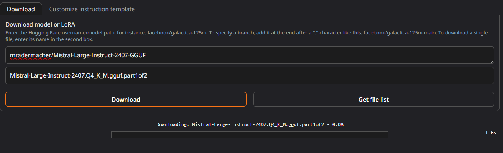
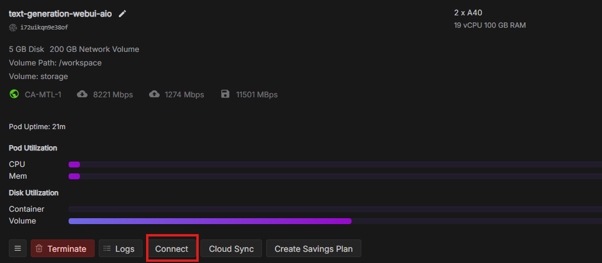
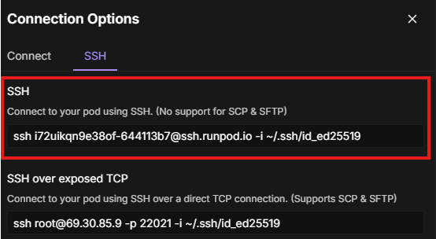

### Loading a GGUF model on multiple GPU's

> ⚠️ This section requires a working SSH connection to your pod. Make sure you've configured your SSH key in RunPod as described earlier. You should be somewhat familiar with SSH and the command line to proceed.

Large GGUF models are a bit trickier to work with. Because Hugging Face has a file size limit, these models are often split into multiple parts. This also means you’ll need **twice the disk space** temporarily — e.g., a 100 GB GGUF model requires 200 GB available to join the files.

For this example, we’ll use Mistral Large in GGUF format:  
https://huggingface.co/mradermacher/Mistral-Large-Instruct-2407-GGUF

---

First, download the model parts. For example, for the `Q4_K_M.gguf` model, download the following files:

- `Mistral-Large-Instruct-2407.Q4_K_M.gguf.part1of2`
- `Mistral-Large-Instruct-2407.Q4_K_M.gguf.part2of2`

Use the text-generation-webui downloader to fetch them as usual:

  


---

Once downloaded, you need to **join the parts** via the command line using SSH.

1. Click `Connect` on your pod and select the **SSH** tab:



2. Use your private SSH key to connect to the pod:



3. Once connected, navigate to the following folder:
```
/workspace/text-generation-webui/user_data/models
```

4. Run the following command to merge the parts into a single `.gguf` file:
```
cat Mistral-Large-Instruct-2407.Q4_K_M.gguf.part* > Mistral-Large-Instruct-2407.Q4_K_M.gguf && rm Mistral-Large-Instruct-2407.Q4_K_M.gguf.part*
```

This will take a while. Once complete, the `.gguf` file is ready.

---

Finally, go back to the text-generation-webui UI, **refresh the model list**, and load the model. It should now work as expected.
