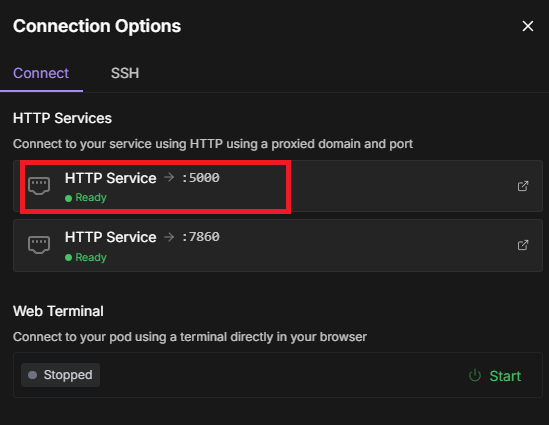

# Connect text-generation-webui runpod to Open WebUI:

First setup the pod as described in the root `README.md` file.

Then fetch the API url (5000) from runpod:

Now while setting up the pod you set the `MY_OPENAI_KEY`, you will need it to communicate with API.

Go to OpenWebUI settings:

Go to `Connections` and add:

Add your url and your `MY_OPENAI_KEY`. Also add `/v1` after the URL. Like this: `https://<my-pod-id-here>-5000.proxy.runpod.net/v1`

