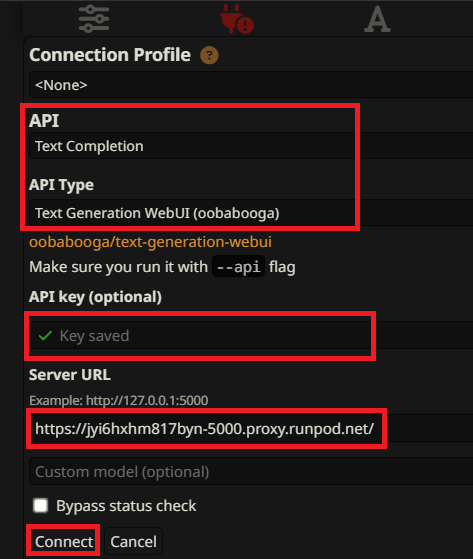
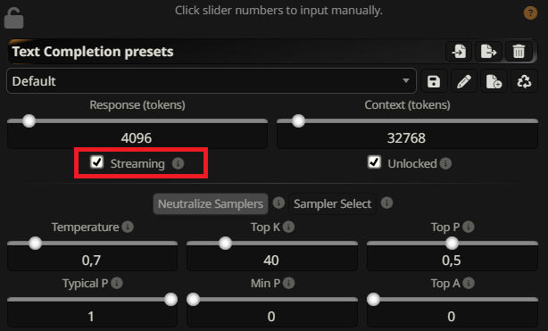

# Connect text-generation-webui runpod to SillyTavern:

First setup the pod as described in the root `README.md` file.

Then fetch the API url (5000) from runpod:

Now while setting up the pod you set the `MY_OPENAI_KEY`, you will need it to communicate with API.

In SillyTavern set API type to `text completion` your api key to the `MY_OPENAI_KEY` vale and server URL to the runpod port 5000 url. Then click `connect`:

Also set `streaming` on in AI response settings. This is a must since Cloudflare has issues with long running api calls.

